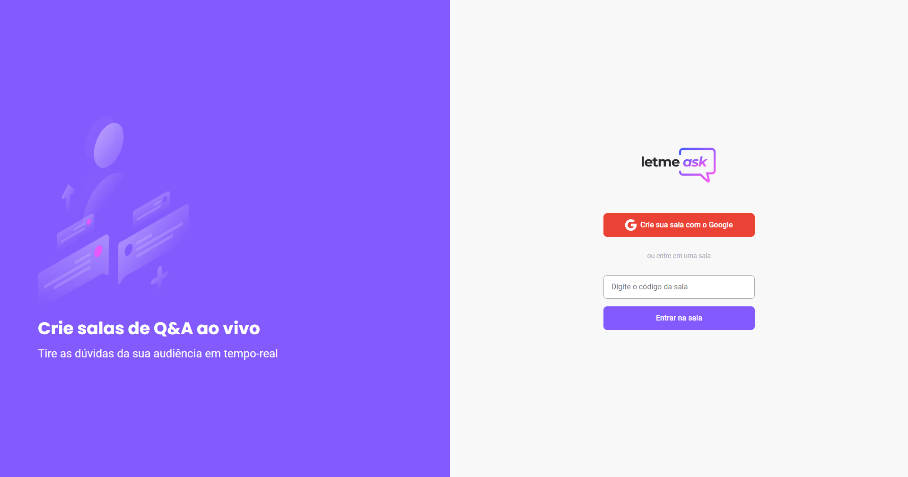

<p align="center">
  
</p>

<p align="center">
  

  
</p>

<h1 align="center">
    
</h1>

<br>

## 🧪 Tecnologias utilizadas

Para este projeto, foram utilizadas as seguintes tecnologias:

- [React](https://reactjs.org)
- [Firebase](https://firebase.google.com/)
- [TypeScript](https://www.typescriptlang.org/)

## 🚀 Como executar

Passo 1: Faça a clonagem do projeto com o comando abaixo:

```bash
$ git clone https://github.com/fsclaro/nlw-06-trilha-reactjs
```

Passo 2: Entre na pasta do projeto:

```bash
$ cd nlw-06-trilha-reactjs
```

Passo 3: Inicie o projeto conforme os passos descritos abaixo:

```bash
# Instalar as dependências
$ yarn

# Iniciar o projeto
$ yarn start
```
O app estará disponível no seu browser pelo endereço http://localhost:3000.

## ☁️ Banco de Dados
O projeto utiliza os recursos do Firebase da Google para armazenamento dos dados, portanto será necessário criar uma conta no [Firebase](https://firebase.google.com/) e um projeto para disponibilizar um Realtime Database.

## 💻 Projeto

O Letmeask é um projeto muito interessante para situações onde se deseja criar um app do tipo Q&A.

Este é um projeto desenvolvido durante a **[Next Level Week Together](https://nextlevelweek.com/)**, apresentada dos dias 20 a 27 de Junho de 2021.


## 🔖 Layout

Você pode visualizar o layout do projeto através do link abaixo:

- [Layout Web](https://www.figma.com/file/u0BQK8rCf2KgzcukdRRCWh/Letmeask/duplicate)

Lembrando que você precisa ter uma conta no [Figma](http://figma.com/).

## 📝 Licença

Esse projeto está sob a licença MIT. Veja o arquivo [LICENSE](LICENSE.md) para mais detalhes.

---

Feito com ❤️ by NandoSalles baseado no projeto original do [NLW 6 da Rocketseat](https://rocketseat.com.br).
